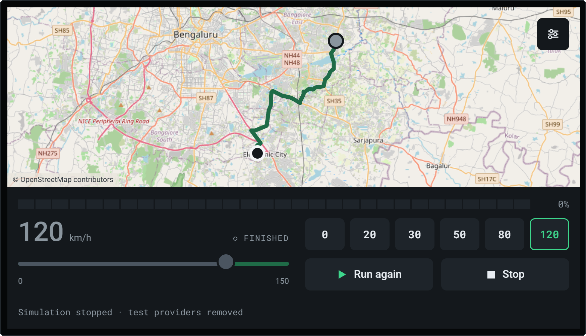
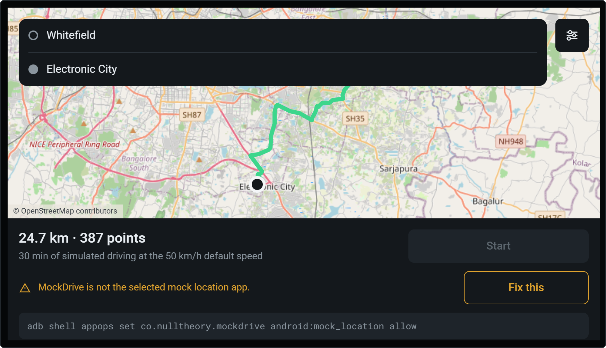
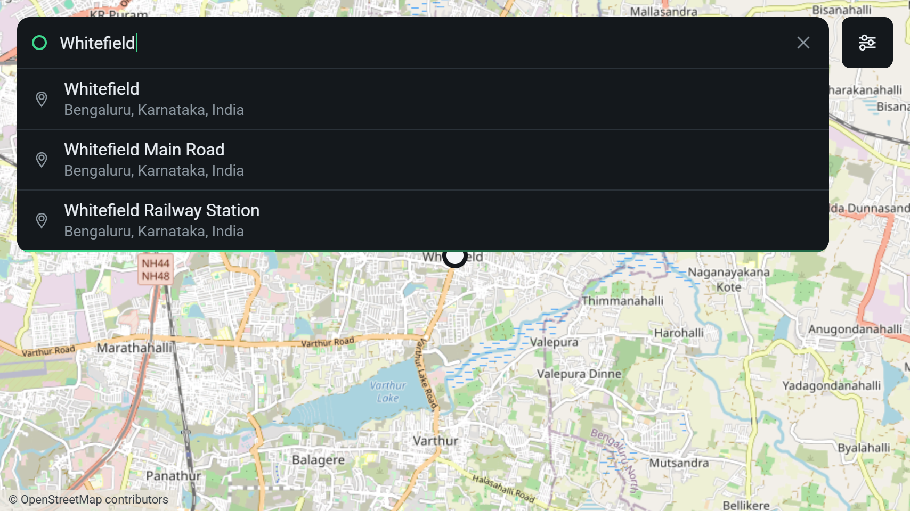
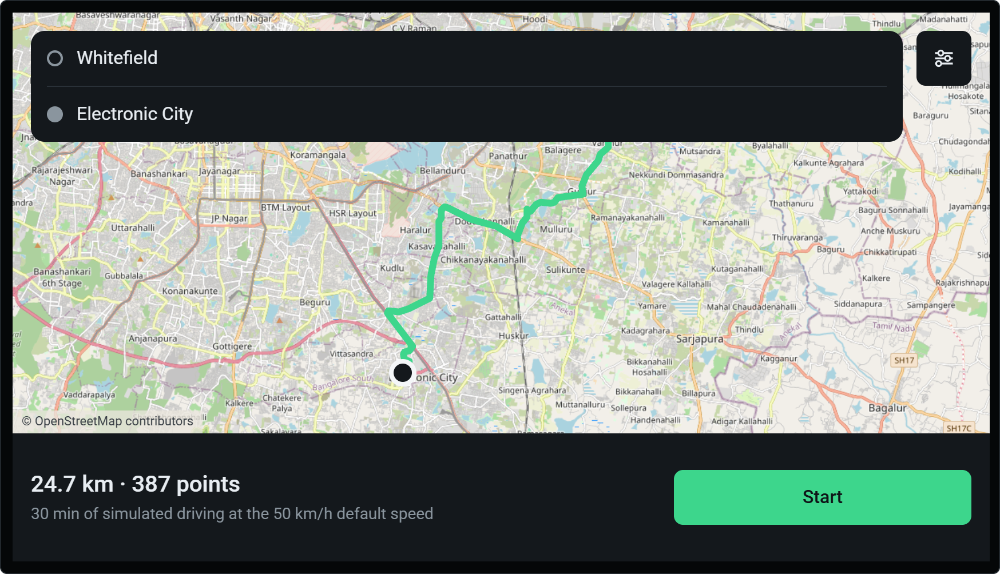
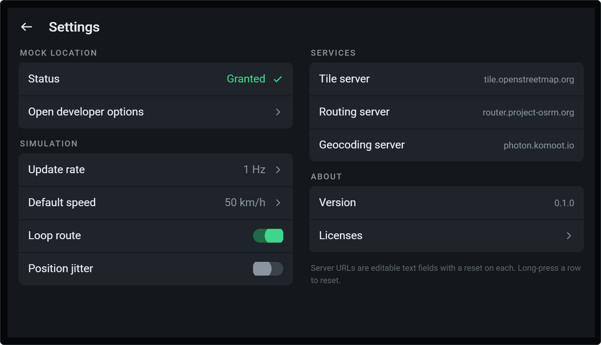
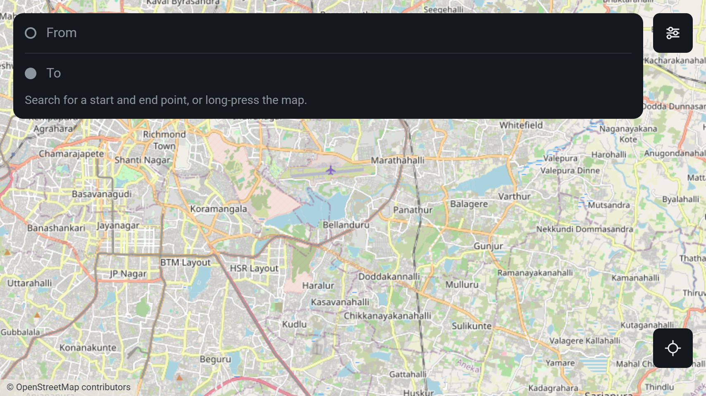

<h1 align="center">Waypoint</h1>

<p align="center">
  <strong>GPS route simulation for Android, with live speed control.</strong><br>
  Test geofences, speed events and trip detection without driving a vehicle.
</p>

<p align="center">
  
  
  
  
</p>

<p align="center">
  
</p>

---

Testing geofence entry/exit, speed events and trip detection on a dashcam normally means
driving a vehicle. Waypoint removes that. Search a start and end point, and the app fetches a
real road route and injects synthetic GPS fixes along it into the Android location framework
at a speed you control with a slider. Every app on the device — including the SDK you are
testing — sees those fixes as if the device were genuinely moving.

Built for AOSP dashcam hardware, and equally happy on an ordinary phone.

| | |
|---|---|
| **No Google Play Services** | Target devices are AOSP builds with no GMS. Nothing links `com.google.android.gms`. |
| **No API keys, no signup** | Every map, geocoding and routing service is keyless. |
| **Fully open source** | Every dependency is OSI-licensed. Shipped under Apache-2.0. |
| **Single APK** | No desktop companion, no server. Everything runs on the device. |
| **Android 8.0 → 16** | `minSdk 26`, `targetSdk 36`. |

## Contents

- [Install](#install) · [Granting mock location](#granting-mock-location)
- [How it works](#how-it-works) · [Screens](#screens)
- [Watching the fixes](#watching-the-fixes)
- [Injection details](#injection-details) — the part that matters
- [Services](#services-and-why-they-are-all-configurable)
- [Building and testing](#building-and-testing) · [Architecture](#architecture)
- [Licensing](#licensing-and-attribution)

## Install

```bash
git clone https://github.com/<you>/waypoint.git && cd waypoint
./gradlew assembleDebug
adb install -r app/build/outputs/apk/debug/app-debug.apk
adb shell appops set in.nulltheory.waypoint android:mock_location allow
```

> **The appop is reset on every reinstall.** Re-run that last line each time, or Start stays
> disabled.

### Granting mock location

`ACCESS_MOCK_LOCATION` in the manifest is necessary but not sufficient — the appop has to be
allowed too, by one of two routes.

On a device with a Settings UI: **Settings → Developer options → Select mock location app →
Waypoint**. The in-app Settings screen deep-links straight there.

On a headless or stripped dashcam, over adb:

```bash
adb shell settings put global development_settings_enabled 1
adb shell appops set in.nulltheory.waypoint android:mock_location allow
```

Until it is granted, Start is disabled and the app shows you the exact command to run:

<p align="center">
  
</p>

## How it works

One search box, used twice. Search a start point and select it, press **Directions**, then
search a destination — selecting it fetches the route and opens the preview.

Or **long-press the map** to drop either point. That is the fastest path when the keyboard is
awkward over `scrcpy`, and the only one that works when the geocoder is unreachable.

### Screens

<table>
<tr>
<td width="50%"></td>
<td width="50%"></td>
</tr>
<tr>
<td><b>Search</b> — debounced 400 ms, biased to the map centre, cancelled on each keystroke.</td>
<td><b>Preview</b> — the duration is derived from your default speed, not a traffic ETA.</td>
</tr>
<tr>
<td></td>
<td></td>
</tr>
<tr>
<td><b>Settings</b> — every service URL is editable, with a reset on each.</td>
<td><b>Idle</b> — the map fills the screen; controls float over it.</td>
</tr>
</table>

### While it runs

The speed slider takes effect on the **very next tick** — no apply button. Preset chips are
the primary control on dashcam hardware, where pointer input is laggy.

Setting speed to **0** keeps the simulation alive and stationary, which is the correct way to
test geofence dwell and idle detection. That is *not* the same as **Pause**, which stops
emitting fixes entirely — the distinction between "vehicle stopped" and "GPS died".

Reaching the end of the route does **not** stop the fixes either. The vehicle holds at the
destination at 0 km/h until you press Stop. Going silent reads as signal loss to a consumer,
and a speed history that merely goes stale reads as *unknown* rather than zero.

The simulation lives in a foreground service, so it survives rotation and backgrounding. Back
out of the running screen and the drive continues — which is exactly what you want while
watching the SDK under test in another app.

Stopping deregisters every test provider. Confirm real GPS is healthy again with:

```bash
adb shell dumpsys location | grep -A5 "gps provider"
```

## Watching the fixes

Every injected fix is logged, one fixed-width line per tick:

```bash
adb logcat -s WaypointFix
```

```text
┌──────────────────────────────────────────────────────────┐
│ SIMULATION STARTED                                       │
├──────────────────────────────────────────────────────────┤
│ route       24.72 km · 387 points                        │
│ emitting on gps                                          │
│ shadowing   gps, network (real fixes suppressed)         │
│ fused       no Play Services on this device              │
│ update rate 1 Hz  (every 1000 ms)                        │
│ speed       50 km/h                                      │
│ jitter      off                                          │
│ loop        off                                          │
└──────────────────────────────────────────────────────────┘
#00001 │   12.995743,   77.757949 │  50 km/h  13.89 m/s │ 143° │ ± 3.0m │ … │ RUNNING │ dt 1.002s
#00002 │   12.995812,   77.757861 │  50 km/h  13.89 m/s │ 143° │ ± 3.0m │ … │ RUNNING │ dt 1.000s
──── SPEED · 50 -> 0 km/h
#00003 │   12.995812,   77.757861 │   0 km/h   0.00 m/s │ 143° │ ± 3.0m │ … │ HOLDING │ dt 1.001s
```

The coordinates are what was **actually injected**, after jitter — not what the simulator
computed. If those two ever disagree, the log is the truth.

`dt` is the measured interval between ticks, not the nominal one, so scheduler drift or a
stalled device shows up directly. `HOLDING` is speed 0 with fixes still flowing; `PAUSED` is
no fixes at all; `ARRIVED` is holding at the destination. Once arrived, logging drops to a
heartbeat every 10 s while injection continues at full rate.

## Injection details

This is the part worth over-engineering. A subtly malformed `Location` is silently dropped by
consuming SDKs and produces an hour of confused debugging.

**`elapsedRealtimeNanos` is set on every fix.** It is the single most common omission, and
many pipelines — the AOSP fused engine included — discard fixes whose elapsed-realtime stamp
is zero. Some consumers also derive their speed timestamps from it rather than from `time`.

**`speed` is metres per second**, with `speedAccuracyMetersPerSecond` alongside it. `bearing`
is normalised to `[0, 360)`, and `accuracy`, `altitude` and `time` are populated every tick,
so consumers gating on `hasSpeed()` / `hasBearing()` behave as they would with a real fix.

**One emitting provider, several shadowed.** A test provider is registered on `gps`, `network`
(and `fused` on API 31+) so real fixes from those names are suppressed — but samples are
pushed to **`gps` only**. Consumers commonly subscribe to both GPS and NETWORK; pushing to
both delivers one `onLocationChanged` per provider per tick, so the SDK sees *double* the
configured rate, and anything deriving speed from consecutive timestamps silently doubles its
answer.

**Play Services, if present.** A consumer built on `FusedLocationProviderClient` cannot see
test providers at all. Where GMS exists, Waypoint also drives it via `setMockMode`. This is
done entirely by reflection so the APK links no Play Services code and stays installable on a
device that has none.

**Test providers are removed on stop**, and re-registered defensively on start — a process
killed mid-run leaves them behind, and `addTestProvider` would then throw "already exists"
until reboot.

**Timing** uses `ScheduledExecutorService.scheduleAtFixedRate`, not `Handler.postDelayed`,
which accumulates drift. `dt` comes from measured elapsed time, so a device that stalls for
300 ms still covers the distance it should have.

### Update rate and consuming SDKs

1, 2, 4, 5 and 10 Hz are offered, but check what the SDK under test expects — several size a
speed ring buffer at 4 samples/sec and silently drop or overwrite above that. Rates over 4 Hz
are labelled accordingly in the picker. The default is 1 Hz.

### Verify it reaches your SDK first

The one thing that can invalidate the whole approach is hardware that bypasses
`LocationManager` — some OEMs read NMEA from a UART straight into a vendor HAL. Check before
trusting the app on a new model:

```bash
adb shell appops set in.nulltheory.waypoint android:mock_location allow
adb shell pm grant in.nulltheory.waypoint android.permission.ACCESS_FINE_LOCATION
./gradlew connectedDebugAndroidTest
```

`MockInjectionTest` registers a test provider, injects one fix, and asserts it comes back out
of a `LocationListener` with speed, bearing and `elapsedRealtimeNanos` intact. If it fails,
mock location cannot reach that unit and the approach has to change.

Injected fixes report `Location.isMock()` (`isFromMockProvider()` below API 31) as **true**.
An SDK that filters mock fixes needs a debug flag to accept them.

## Services, and why they are all configurable

| Concern | Default | License |
|---|---|---|
| Map tiles | `tile.openstreetmap.org` | OSM data is ODbL |
| Routing | `router.project-osrm.org` | BSD-2-Clause |
| Geocoding | `photon.komoot.io` | Apache-2.0 |

All three are **shared community resources**, and all three are editable in Settings for
exactly that reason. Point them at your own instances for anything beyond bench testing:

- The OSM Foundation [tile usage policy](https://operations.osmfoundation.org/policies/tiles/)
  discourages distributed applications. Waypoint sends an identifying User-Agent, but heavy
  use belongs on your own tile server. The field takes either a prefix (`https://host/`) or a
  template (`https://host/{z}/{x}/{y}.png`).
- The OSRM demo server is best-effort — self-host
  [osrm-backend](https://github.com/Project-OSRM/osrm-backend).
- Photon is courtesy of Komoot — self-host [photon](https://github.com/komoot/photon).

Routes are cached in `filesDir`, keyed by endpoints **and** routing server, so a route fetched
once replays forever with no network. The test bench will not always have wifi.

> **If search fails but the map still loads**, the device cannot reach the geocoding host.
> Long-press the map to set both points instead — that path needs no geocoder at all.

## Building and testing

```bash
./gradlew assembleDebug            # APK
./gradlew testDebugUnitTest        # JVM unit tests, no device needed
./gradlew lintDebug                # lint
./gradlew connectedDebugAndroidTest  # on-device injection check
```

`RouteSimulator` and `GeoUtils` have **no Android dependencies at all**, so the interpolation
maths is unit tested on a bare JVM — including the milestone check that 50 km/h for ten
seconds covers 139 m, that speed 0 holds position while still emitting, and that arriving
holds the destination at a standstill.

## Architecture

```text
MainActivity.kt        Screens 1-3, state machine, map wiring
SettingsActivity.kt    Settings
LicensesActivity.kt    Attribution
net/    Geocoder · Router · RouteCache · Http
sim/    RouteSimulator · GeoUtils · MockLocationService · MockPermission
        FusedLocationInjector · SimLog
ui/     SearchAdapter · SimState · MapTiles · Format · SegmentedProgressBar
```

The service owns the simulation; the Activity binds and observes. That is what lets a fake
drive survive rotation, backgrounding, and you switching to another app to watch its
behaviour.

**Stack:** Kotlin · Views + ViewBinding + Material Components · osmdroid ·
OkHttp · kotlinx-coroutines · `org.json`. Deliberately no Compose (osmdroid is a `View`, and
older AOSP builds are less predictable with it), no Retrofit, no Hilt, no Room — the
dependency list is short enough to audit.

## Roadmap

Not built yet: signal dropout, per-segment speed profiles, harsh-braking event injection,
dwell scripting, GPX replay, offline MBTiles, and `am broadcast` control for CI. Position
jitter is implemented (Gaussian, ~3 m sigma, behind the Settings toggle).

## Licensing and attribution

Copyright 2026 nulltheory.

Licensed under the **Apache License 2.0**. See [LICENSE](LICENSE), which is Apache's canonical
text, unmodified — the bracketed placeholders in its appendix are part of that text and are
meant to stay.

| Component | License |
|---|---|
| OpenStreetMap data | ODbL — "© OpenStreetMap contributors" is rendered on the map itself, as required |
| osmdroid | Apache-2.0 |
| OkHttp / Okio | Apache-2.0 |
| Kotlin stdlib, kotlinx.coroutines | Apache-2.0 |
| AndroidX, Material Components | Apache-2.0 |
| Photon | Apache-2.0 |
| OSRM | BSD-2-Clause |

Full text is in the in-app **Settings → Licenses** screen.

## Contributing

Issues and pull requests welcome. Two things to know before you start:

1. `RouteSimulator` and `GeoUtils` must stay free of Android imports — that is what keeps the
   maths testable on the JVM.
2. Changes to the fix payload in `MockLocationService.inject()` need a matching assertion in
   `MockInjectionTest`. Everything else in this app is replaceable; a malformed `Location` is
   what makes somebody conclude the tool does not work.
